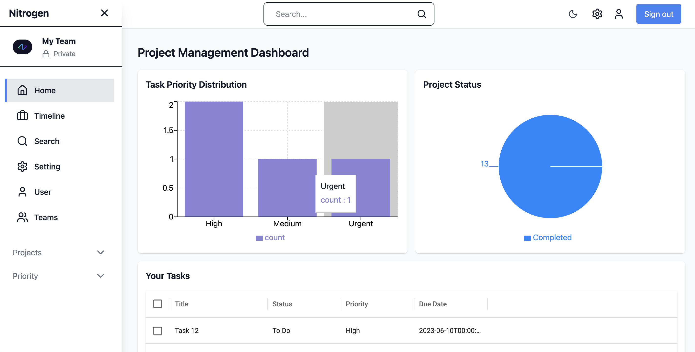
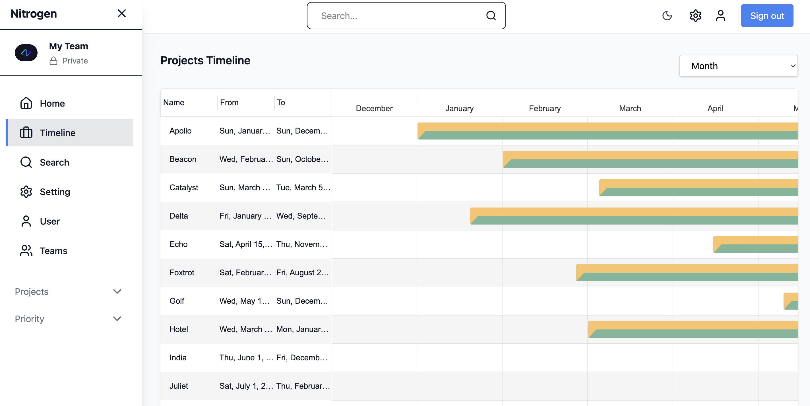

# 🚀 Nitrogen – Frontend

Nitrogen is a **modern project & task management platform** designed for teams to manage projects, tasks, priorities, and collaboration efficiently.

This repository contains the **Frontend application**, built with modern web technologies and fully integrated with AWS services and a scalable backend.

---

## 🌐 Live Application

🔗 **Production URL:**  
https://main.d2zm25dwm40v68.amplifyapp.com

---

## 🧠 What This App Does

- User authentication via **AWS Cognito**
- Create & manage **Projects**
- Create, assign & track **Tasks**
- Priority-based task views (Urgent, High, Medium, Low, Backlog)
- Real-time data fetching with caching
- Secure API communication with JWT tokens

---

## 🖥️ Screenshots

> 📌 Replace the image paths below with actual screenshots later

---

### 📊 Dashboard Overview


---

### 📁 Timeline



## 🧱 Tech Stack

### Frontend Core
- **Next.js 14 (App Router)**
- **TypeScript**
- **React 18**
- **Tailwind CSS**

### State Management
- **Redux Toolkit**
- **RTK Query** (API caching & data fetching)

### UI & Components
- **Material UI (DataGrid)**
- **Custom reusable components**
- **Modal-based workflows**

### Authentication & Security
- **AWS Cognito**
- **AWS Amplify Auth**
- **JWT-based Authorization**

---

## 🔁 Frontend Architecture Flow

```

User Action (UI)
↓
RTK Query Hook
↓
AWS API Gateway
↓
Backend (Express + Prisma)
↓
PostgreSQL (RDS)

````

---

## 🔐 Authentication Flow

1. User logs in via **AWS Cognito**
2. Cognito returns **JWT Access Token**
3. Token is automatically attached to API requests
4. Backend validates token
5. Authorized data is returned

---

## 📡 API Communication

All API calls are managed using **RTK Query**.

Example:
```ts
useGetProjectsQuery()
useCreateTaskMutation()
````

### Base API Configuration

```ts
baseUrl: process.env.NEXT_PUBLIC_API_URL
```

---

## ⚙️ Environment Variables

Create a `.env.local` file in the root:

```env
NEXT_PUBLIC_API_URL=https://15kg1nxcp2.execute-api.ap-south-1.amazonaws.com/prod
NEXT_PUBLIC_COGNITO_USER_POOL_ID=ap-south-1_xxxxx
NEXT_PUBLIC_COGNITO_USER_POOL_CLIENT_ID=xxxxxxxx
```

---

## ▶️ Running Locally

### 1️⃣ Install dependencies

```bash
npm install
```

### 2️⃣ Start development server

```bash
npm run dev
```

### 3️⃣ Open browser

```
http://localhost:3000
```

---

## 📂 Project Structure

```
src/
│── app/                # Next.js app router
│── component/          # Reusable UI components
│── state/              # Redux & RTK Query
│── styles/             # Global styles
│── utils/              # Helpers & constants
```

---

## 🧪 Common Features Implemented

* ✅ Protected routes
* ✅ Loading & error states
* ✅ Optimistic updates
* ✅ Priority filtering
* ✅ Form validation
* ✅ Production-ready API integration

---

## 🚀 Deployment

* Hosted on **AWS Amplify**
* Auto-deploys on `main` branch push
* Environment variables configured in Amplify console

---

## 🧑‍💻 Author

**Harsh Jajaniya**
Frontend • Backend • Cloud Architecture

---

## 📌 Notes

* Backend runs independently via AWS API Gateway
* Prisma & DB logic is **not** handled here
* This frontend is fully production-ready

---

## ⭐ If you like this project

Give it a ⭐ on GitHub and feel free to contribute!
```
